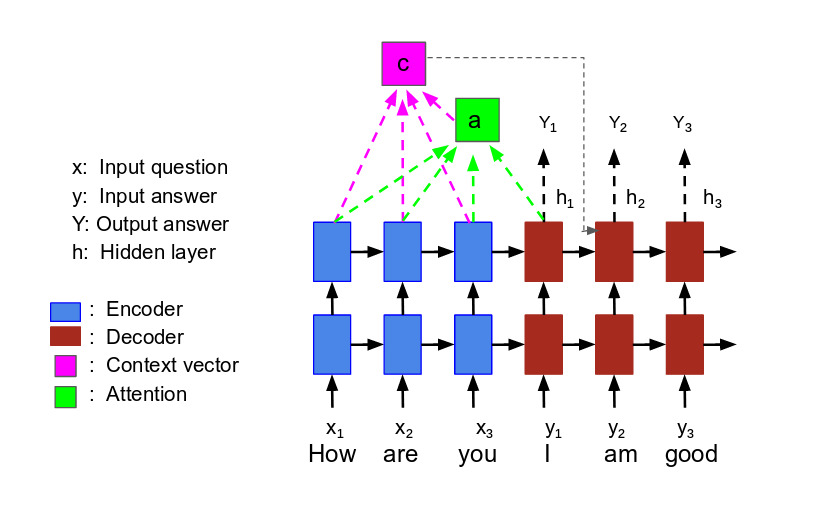

# GraphaQA
[](https://travis-ci.org/yuzhiliu/graphqa)

GraphQA is a question answering (QA) system built ove knowledge graphs (KG).

This is based on [english2cypher](https://github.com/Octavian-ai/english2cypher) [David Mack](https://medium.com/@DavidMack) built.


## Requirements

- Python 3.6
- Neo4j (for inference only)
- Docker 17.03 or above
- Nvidia GPU (training instance)


Currently the code is only tested under Python 3.6. The code will not work
properly for Python version less than 3.6. This is mainly due to the use of
[*f-String*](https://realpython.com/python-f-strings/) in the code. If the
default Python version is not 3.6, one can either create a [*Virtual
Environment*](https://docs.python-guide.org/dev/virtualenvs/) or use
[*Conda*](https://docs.anaconda.com/anaconda/user-guide/tasks/switch-environment/).

## Installation:
Once Python 3.6 is installed, you can download this source code by running
```shell
git clone https://github.com/yuzhiliu/graphqa/
```

To install all the dependencies needed for running the code, one can first go
to the package directory
```shell
cd graphqa
```
and then run
```shell
make install
```

## Training – How to train a GraphQA system

Let's train our GraphQA model, translating from English to
[Cypher](https://neo4j.com/developer/cypher-query-language/)! 

We will use [CLEV graph](https://github.com/Octavian-ai/clevr-graph) dataset
[Octavian-ai](https://www.octavian.ai/) created. The full dataset can be found
[here](https://drive.google.com/open?id=1r2BS07_2lB25Vlo6a9HiafewTGENmI80).

Run the following command to download and preprocess the data
```shell
python -m graphqa.build_data \
    --input-dir=./data/ \
    --skip-extract=False \
    --gqa-path=./data/gqa.yaml \
    --eval-holdback=0.2 \
    --predict-holdback=0.1  \
    --vocab-size=120
```

This will download the data automatically to ./data/gqa.zip, unzip the file,
preprocess the data, and extrat the data for training, validation, and testing.

The whole dataset is about 300MB and it will take a while to process the data.

Run the following command to start the training:
```shell
python -m graphqa.train \
    --skip-training=False \
    --tokenize-data=False \
    --output-dir=./output \
    --model-dir=./output/model \
    --max-steps=300 \
    --predict-freq=3 \
    --batch-size=128 \
    --num-units=1024 \
    --num-layers=2 \
    --beam-width=10 \
    --max-len-cypher=180 \
    --learning-rate=0.001 \
    --dropout=0.2
```

The above command trains a two-layer model with 1024-dim hidden units and
embeddings for max-steps/predict_freq = 100 epochs. A dropout value of 0.2 is
used.

The model is saved in the ./output/model directory.

Alternatively, one can try
```bash
python -m graphqa.train --quick
```
This will use smaller batch size, one layer network, et al. and existing small
test input files to train the model. The result will not be good at all though.
It might be helpful to use this to debug the code.

## Inference – How to use the model to build a QA system

Once you have trained your model, you can use it to translate previously unseen
English question to Cypher query language. This process is called inference.
Since the ultimate goal is to get answers from the graph database, you will
need to have a graph database installed to run the inference. The simplest way
is to run a Docker image created by [Andrew
Jefferson](https://neo4j.com/staff/andrew-jefferson/) and then create a
database by running
```shell
bash start-neo4j-database.sh
```

After the database is created, you can also access the database from a regular
browser window by typing [http://localhost:7474](http://localhost:7474) and
signing in with Username: neo4j, Password:goodpasswd. At this stage, the
database is empty.

You can then run the following script to start the inference
```shell
python -m graphqa.predict
```

## Some details about the model

### 


<p align="center">

<br>
Figure 1. attention.
</p>


# Build the dataset to be used by training

Run
```bash
python -m graphqa.build_data
```
This will download the data from
[GoogleCloud](https://storage.googleapis.com/octavian-static/download/english2cypher/gqa.zip),
tokenlize the data, and partition them into three different files for training,
evaluation, and prediction. The files will be saved under data/ diretory as
"data/gqa.yaml", and six "txt" files by default.

# Training the model

Run
```bash
python -m graphqa.train
```
This will take a while to complete.

Alternatively, one can try
```bash
python -m graphqa.train --quick
```
This will use smaller batch size, one layer network, et al. and existing small
test input files to train the model. The result will not be good at all though.
It might be helpful to use this to debug the code.

# Running the model to make predictions

You will need to have a graph database installed to make predictions. The
simplest way is to run a Docker image created by [Andrew
Jefferson](https://neo4j.com/staff/andrew-jefferson/) and then create a
database by 

```bash
bash start-neo4j-database.sh
```

One can then run the following script to make predictions
```bash
python -m graphqa.predict
```
